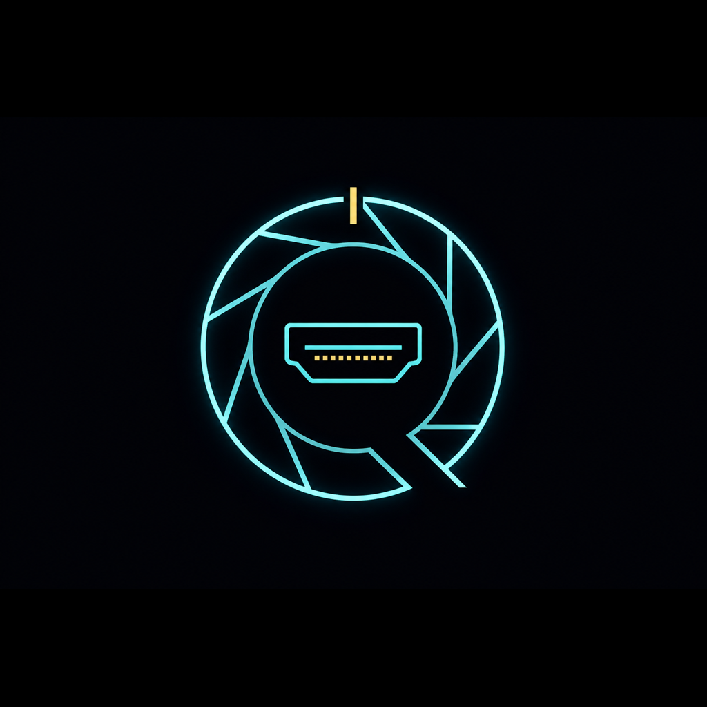
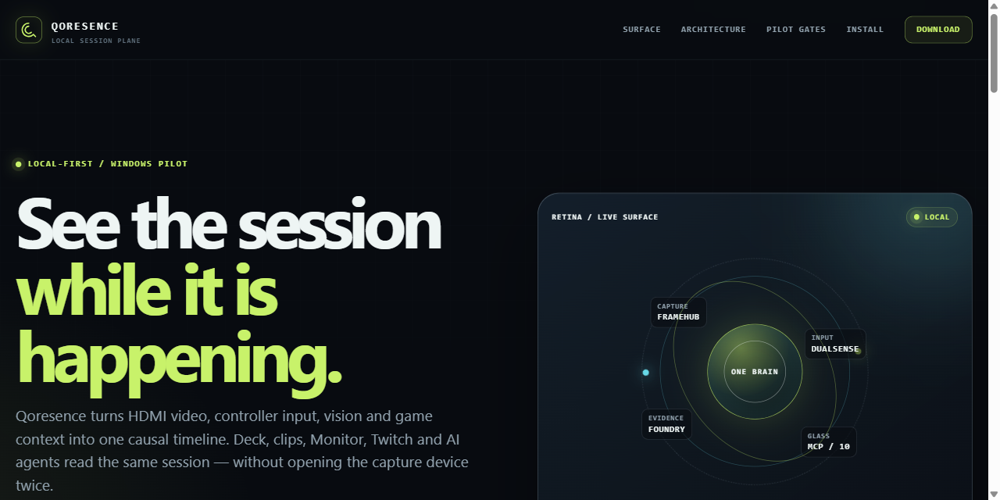
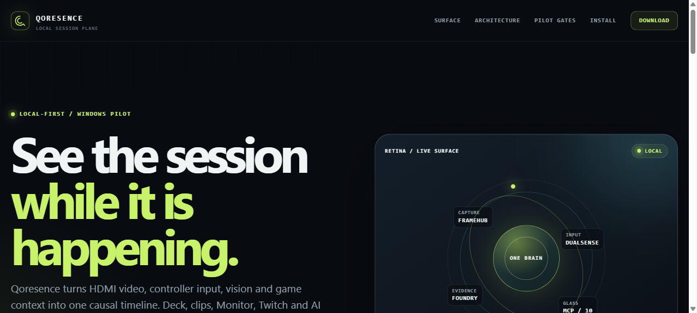

# Qoresence

<p align="center">
  
</p>


**Gaming Streaming Observatory Engine** — local-first, one clock, many glasses.

Qoresence turns HDMI video, DualSense HID, and game situation into a **single causal event bus**, then surfaces it through **Retina Deck** (Aperture Glass), native Retina Monitor, local HDMI clips, and **AgentGlass / MCP**. Chat, heat, and score digits are licensed by the **shared clock plus tickets** — not by coworker personas. The capture card is the brain; everything else is a glass. Twitch is not a product route.

| What it is | What it is not |
|------------|----------------|
| Observation of HDMI + DualSense on one monotonic clock | Anti-cheat, humanity, or eligibility claims |
| Co-occurrence, coupling, presence evidence | Live path into QorTroller / PoAC / `*-truth` |
| Empty glyphs (`□–□`) and DualSense-on-PS5 emptiness | Invented `0–0`, last-good overlay, PAD WAIT as failure |
| Local MP4 + button / coupling / OTel sidecars | Dual-opening the same capture card |
| Optional research wrap onto `qoresence-research` with a grant | On-chain by default |

Docs: [GitHub Pages](https://conwan30.github.io/Qoresence/) · [Install guide](https://conwan30.github.io/Qoresence/install.html) · [Wiki](https://github.com/ConWan30/Qoresence/wiki) · [Download](https://github.com/ConWan30/Qoresence/releases/latest)

Public face: **[X @Qoresence](https://x.com/Qoresence)** — receipts from real play. The observatory stays on your machine.

Every lobe is **OFF** until you opt in.

[](https://github.com/ConWan30/Qoresence)
[](https://x.com/Qoresence)
[](https://conwan30.github.io/Qoresence/)
[](https://github.com/ConWan30/Qoresence/wiki)
[](https://www.python.org/)

<p align="center">
  
</p>

<p align="center">
  <a href="https://conwan30.github.io/Qoresence/">
    
  </a>
</p>

---

## What makes it novel

| Idea | Why it matters |
|------|----------------|
| **One brain → N glasses** | Situation + events once; Lens (OBS), Retina Deck, **Session Theater**, **Mobile Glass**, Monitor, Stem are *views* |
| **Ticket-clock** | Coupling ticket licenses heat / pad–picture join. Confirm ticket + `score_vlm_locked` licenses digits. Actuators: Aperture / Bind / License / Arm — not Agent Society coworkers |
| **Aperture Glass** | One visual system: Retina Deck SPA + public GitHub Pages. Flat void, machined iron, HOLD glyphs. Never fake LIVE on the site |
| **Fail-closed speech** | Unlocked scores stay empty. DualSense on the PS5 (no laptop HID) is success, not PAD WAIT. Same-Seq: widgets match the LIVE frame or they go dark |
| **Session Theater** | `/session.html` — Now + Story + Recap over a fail-closed normalized pack; live `GET /api/session/view` and `/api/session/recap`; Open clip only for validated existing MP4s |
| **CIVIF** | Coupled Input–Video Intelligence Framework. Live ticks + clip records; `/civif.html` and `GET /api/civif/live`. Session Theater is a query over that pack — not a second capture |
| **Title-presence** | Optical title lock with a hard `plane` tag; on with `--play`; menu/pause fail-closed; does not yank an explicit `--game-profile` |
| **Qoresence owns the card** | Physical HDMI has one owner — Qoresence Streamer; OBS uses Browser Source for Lens only (no dual-open) |
| **FrameHub (no second capture)** | Streamer already holds BGR frames; monitor + IVC **subscribe** — never dual-open DShow |
| **Input–Video Coupler (IVC)** | DualSense edges join `clock_ns` / `frame_seq` for co-occurrence *coupling* (observation only) |
| **Ghost Stick** | Pad locus painted on the HDMI frame it belongs to. Default ON under `--play`. Veto when Same-Seq / coupling drops |
| **Two-speed ClutchBot** | `path=fast` video+input soft acts; OCR + DeepSeek vision is `path=confirm` referee (never invents scores on fast) |
| **A2A bus (optional)** | Quicksilver scene/chat under local policy; does **not** replace OCR / confirm tickets |
| **Local HDMI Foundry** | True capture-ring clips (`clips/*.mp4`) + `.buttons.json` / `.coupling.json` / `.otel.json` sidecars |
| **Foundry RAG** | Search past clips by chapter/buttons/graph/timeline — software-only, no capture needed |
| **OpenTelemetry (optional)** | Causal bus traces + metrics; per-clip sidecars — local OTLP, default OFF. Exporter may only enqueue |
| **Causal event bus** | Every event carries `session_id` + `clock_ns` + `source_lobe` |

**Language:** *co-occurrence / coupling / presence evidence* — **not** legitimacy verification.

---

## Architecture (novel stack)

```text
 PS5 HDMI → capture card (physical DShow, e.g. USB3.0 Video)
        │
        ▼
 ┌────────────────────────────────────────────────────────────┐
 │   StreamerRuntime OWNS card  (--streamer-device 0)          │
 │   clip_buffer · FrameHub · OCR / DeepSeek vision · Foundry │
 └───────┬──────────────────────────────┬─────────────────────┘
         │                              │
         ▼                              ▼
  Deck LIVE (Aperture Glass SPA) DualSense-on-PS5 (empty laptop HID = success)
  Session / Mobile / Monitor     optional: DualSense USB here → InputRing → IVC
  Ghost Stick on Same-Seq LIVE
         │                              │
         └──────────┬───────────────────┘
                    ▼
             RetinaEventBus → Situation / title-presence / tickets / ClutchBot / AgentGlass / MCP
                    │
    Coupling ticket  → heat / pad–picture (fast)
    Confirm ticket   → score digits (confirm + score_vlm_locked)
                    │
    OBS (optional stream): Browser Source ONLY
    http://127.0.0.1:8765/overlay.html  — do NOT open the same physical card
    Deck:     http://127.0.0.1:8765/deck.html
    Session:  http://127.0.0.1:8765/session.html  (Now + Story + Recap; not HDMI)
    CIVIF:    http://127.0.0.1:8765/civif.html
    Phone:    http://127.0.0.1:8765/mobile.html  (LAN: --deck-bind 0.0.0.0 + scan QR)
```

**Planes**

| Plane | Default | Role |
|-------|---------|------|
| Capture | Opt-in per lobe | Streamer, controller, screen, outcome, visual |
| Situation | With `--play` | Score, down, clutch context — digits only when confirm-licensed |
| Operator glass | `--deck` / `--monitor` | Aperture Glass Theater, Session Theater, Lens, Mobile Glass, native monitor |
| Clutch (local) | `--play` | Deck feed + local HDMI clips (Twitch leftover, default-OFF) |
| Stem | conductor on `--play` | Situation-directed program; `--stem-program` / `--stem-audio` / `--stem-record` default OFF |
| Spectator | `--agent-glass` | HTTP/WS API + MCP for AI agents |
| Society | `--agent-society` | **Leftover stub.** Default OFF. `--play` does not enable. Actuators, not coworkers |
| Research | Off | Fusion, trio-retina / WASM, Streamr plugin |

---

## Recent milestones (shipped on `main`)

| Theme | What landed |
|-------|-------------|
| **Aperture Glass + Pages** | One chrome for Deck SPA and GitHub Pages. HOLD command bar, theater Watch, 6m45s NCAA 27 demo. Never fake LIVE on the public site ([#125](https://github.com/ConWan30/Qoresence/pull/125)). Public face: [X @Qoresence](https://x.com/Qoresence) |
| **Ticket-clock + confirm remint** | Coupling ticket licenses heat; confirm ticket + `score_vlm_locked` licenses digits. Same `ticket_id` reused across DAL/Dallas/empty flicker (#116) |
| **Quicksilver confirm path** | Scoreboard / observation vision is `deepseek-v4-flash` on the same Quicksilver API + clutchbot key as ClutchBot chat. Not Gemini. Not `api.deepseek.com` / `deepseek-v4-flash-vision-exp` (402). JPEG crop in, JSON scorebug out |
| **Ghost Stick** | Default ON under `--play`. DualSense locus on the HDMI frame it belongs to. Same-Seq veto (`docs/GHOST_STICK.md`) |
| **Empty HID is success** | DualSense stays on the PS5. No laptop HID is not PAD WAIT (TCBS). Bind owns DualSense↔HDMI join |
| **MatchAgent** | Opt-in observer (`--match-agent` / `QORESENCE_MATCH_AGENT=1` on operator launchers). Fail-closed `last_note` on Clutch Feed. DualSense stays on the PS5 |
| **Aperture Glass Theater** | Viewport HUD, Clutch Feed rail, licensed SituationCard, hid_by_seq press chip, observatory instrument. SPA served at existing Deck URLs |
| **Seeing-path ConfirmTicket** | Unlicensed HUD digits never serialize. First-class `cfb_27` / Madden HUD crops even when `game_state` is menu (#108 / #110). Identity swap does not invent 0–0 |
| **HID log-once** | Classify HID domain once per transport — not 1 kHz INFO that freezes the capture thread (#117) |
| **CIVIF** | Live coupled ticks + clip records; `/civif.html`. Score digits only when `board_locked`. Empty HID on this host is valid (`docs/CIVIF.md`) |
| **Session Theater** | `/session.html` Now + Story + Recap; `GET /api/session/view` + `/api/session/recap`; fail-closed score/HID; validated `hdmi_clip_*` Open clip |
| **Mobile Glass + QR** | `/mobile.html` FrameHub WebRTC (MJPEG fallback); Theater copy-link + QR when `--deck-bind 0.0.0.0` |
| **Title-presence** | Hysteresis wrap on `GameAutoDetector`; on with `--play`; `--game-profile` pin honored |
| **Deadlock hardening** | Re-entrancy guard in A2A + presence; OTel subscribe may only enqueue; `tests/test_deadlock_regression.py` |
| **OpenTelemetry** | `--otel` causal bus traces + coupling metrics; `.otel.json` / `.coupling.json` clip sidecars; Jaeger on localhost |
| **MCP universal glass** | 12 tools including fail-closed `get_observation` and grant-gated `wrap_observation` (`qoresence-research` only) |
| **Foundry RAG** | `search_clips` / `get_drive_graph` searchable session memory — software-only, no capture card |

Docs for each: [SESSION_THEATER](docs/SESSION_THEATER.md) · [CIVIF](docs/CIVIF.md) · [GHOST_STICK](docs/GHOST_STICK.md) · [TWO_SPEED_CLUTCHBOT](docs/TWO_SPEED_CLUTCHBOT.md) · [PLAY_PHRASE_COUPLING_TICKET](docs/PLAY_PHRASE_COUPLING_TICKET.md) · [MOBILE_GLASS](docs/MOBILE_GLASS.md) · [TITLE_PRESENCE](docs/TITLE_PRESENCE.md) · [WEBRTC_LIVE](docs/WEBRTC_LIVE.md) · [OBS_OWNS_CARD](docs/OBS_OWNS_CARD.md) · [RETINA_MONITOR](docs/RETINA_MONITOR.md) · [CONTROLLER_VIDEO_SYNC](docs/CONTROLLER_VIDEO_SYNC.md) · [OTEL](docs/OTEL.md) · [ROADMAP](docs/ROADMAP.md) · [PILOT_SESSION](docs/PILOT_SESSION.md) · [PILOT_MONITOR](docs/PILOT_MONITOR.md)

---

## Capture (choose one owner)

**One physical HDMI/DShow device → one owner.** Full guide: [docs/CAPTURE_OWNERSHIP.md](docs/CAPTURE_OWNERSHIP.md)

| Goal | Pattern |
|------|---------|
| Low-lag pilot / native monitor | **B** — Qoresence owns card |
| OBS as broadcast director | **A** — OBS owns card → Virtual Cam |

```powershell
python -m qoresence.cli --streamer-list
# Pattern B (recommended): free the physical card from OBS, then:
python -m qoresence.cli --play --deck --monitor --agent-glass --streamer-fps 60
# Pattern A: OBS Video Capture on card + Start Virtual Camera, then --streamer-device <VCAM>
```

---

## Download and install (Windows)

The recommended user path is the versioned **Windows starter package** published on GitHub Releases. It includes the source, local installer, Deck/AgentGlass/MCP stack, pilot docs, and a launcher. Python 3.11+ is required; the installer creates a local `.venv` and does not include capture-card drivers or secrets.

- [Download the latest Windows package](https://github.com/ConWan30/Qoresence/releases/latest)
- [Windows installation guide](https://conwan30.github.io/Qoresence/install.html)
- Verify the SHA-256 file beside the ZIP when downloading a release.

```powershell
# From the extracted Qoresence folder
powershell -ExecutionPolicy Bypass -File .\Install-Qoresence.ps1
.\Start-Qoresence.bat
```

## Quickstart (Windows-first pilot)

```powershell
git clone https://github.com/ConWan30/Qoresence.git
cd Qoresence
pip install -e ".[pilot]"   # capture, Deck, Monitor, AgentGlass/MCP, Windows discovery
python scripts/pilot_preflight.py

# Pattern B: Close OBS Video Capture on the physical card (no dual-open)
python -m qoresence.cli --streamer-list
python -m qoresence.cli --play --deck --monitor --streamer-fps 60
# Or double-click qoresence.bat (defaults: --play --deck --monitor --tray --a2a --controller --streamer-fps 60;
# MatchAgent via QORESENCE_MATCH_AGENT=1 on this launcher only — --play itself does not enable it)

# OBS (optional stream): Browser Source only → http://127.0.0.1:8765/overlay.html
```

| URL | Glass |
|-----|--------|
| http://127.0.0.1:8765/deck.html | Retina Deck — Aperture Glass Theater (LIVE) |
| http://127.0.0.1:8765/session.html | Session Theater (Now + Story + Recap) |
| http://127.0.0.1:8765/civif.html | CIVIF live ticks / highlights (JSON ~1 Hz) |
| http://127.0.0.1:8765/api/session/view | Normalized live session envelope |
| http://127.0.0.1:8765/api/session/recap | Read-only `session-recap-1` |
| http://127.0.0.1:8765/overlay.html | Clutch Lens (OBS Browser Source) |
| http://127.0.0.1:8765/mobile.html | Mobile Glass (phone view; WebRTC / MJPEG) |
| http://127.0.0.1:8765/trace.html | Local OTel / coupling trace viewer |
| http://127.0.0.1:8765/video | LIVE MJPEG |
| http://127.0.0.1:8765/health | Capture + lock + ticket health (`age_s`, frames, `score_vlm_locked`) |
| http://127.0.0.1:8765/api/situation | Snapshot (+ `controller` when IVC on; digits only when locked) |
| http://127.0.0.1:8765/api/agent/snapshot | AgentGlass: curated state + coupling |
| http://127.0.0.1:8765/api/agent/events | AgentGlass: cursor-paginated events |
| http://127.0.0.1:8765/agent/stream | AgentGlass: live WebSocket stream |

### Verify live

```powershell
# within ~10s of start — use Write-Host so PowerShell always shows a labeled line:
$h = Invoke-RestMethod http://127.0.0.1:8765/health
Write-Host "age_s=$($h.state.video.age_s)  frames=$($h.state.video.frames)  locked=$($h.state.situation.score_vlm_locked)"
# healthy: age_s < 1, frames climbing. Unlocked scores stay empty — that is success.

# open Deck (browser does not auto-open from CLI):
Start-Process http://127.0.0.1:8765/deck.html
```

**Note:** `python -m qoresence.cli --play ...` keeps running in that window (log lines only). Deck is a **browser** URL — it does not pop up by itself. Hard-refresh if the tab was open before restart.

Session notes: [docs/PILOT_SESSION.md](docs/PILOT_SESSION.md). While playing, `python scripts/pilot_monitor.py` writes `logs/pilot/closeout_*.md` ([docs/PILOT_MONITOR.md](docs/PILOT_MONITOR.md)). After the session stops, optional one-shot `python -m qoresence.cli --logbook` writes a short debrief from JSONL + chapters ([docs/LOGBOOK.md](docs/LOGBOOK.md); default OFF).

**Gameplay eye:** TV / Retina Monitor (Pattern B) or OBS Preview (Pattern A). Shared `clock_ns` — not a stream-delay clock.

ClutchBot on `--play` is **Deck feed + local HDMI clips**. Twitch IRC/Helix is leftover code, default-OFF, not a launch path. Do not set `--clutchbot-channel` for the local pilot.

---

## AgentGlass + MCP (optional)

Any MCP-compatible AI (Cursor, Claude, etc.) can query Qoresence over stdio.

```powershell
# run Qoresence with the spectator glass
.\qoresence.bat --play --deck --agent-glass --streamer-fps 30

# list tools
qoresence-mcp --help-tools

# add to Cursor / Claude Desktop mcp.json
{
  "mcpServers": {
    "qoresence": {
      "command": "python",
      "args": ["-m", "qoresence.mcp.server"],
      "env": { "QORESENCE_AGENT_GLASS_HOST": "127.0.0.1", "QORESENCE_AGENT_GLASS_PORT": "8765" }
    }
  }
}
```

Agents must call `get_observation` before they speak. Unlocked scores and localhost URLs stay silent. Wrap dest is `qoresence-research` only, and only with an operator grant.

---

## Components

### Core · Lobes · Sync · Monitor · Deck · Agents

| Path | Role |
|------|------|
| `qoresence/core/` | Session, `RetinaEventBus`, unified config, types |
| `qoresence/lobes/` | streamer, controller, screen, outcome, visual |
| `qoresence/sync/` | **InputRing**, **Input–Video Coupler** |
| `qoresence/monitor/` | **FrameHub**, OpenCV Retina Monitor |
| `qoresence/vision/clip_buffer.py` | HDMI ring + Foundry export + buttons sidecar |
| `qoresence/deck/` | FastAPI Deck, overlay, LIVE, clip API (serves Aperture Glass SPA) |
| `glass/` | Retina Deck / Session Theater SPA source (Aperture Glass) |
| `qoresence/agents/` | SituationModel, MomentScorer, ClutchBot, MatchAgent, **AgentGlass**, **MCP** |
| `qoresence/observability/` | OTel exporter (enqueue-only on the bus thread) |
| `qoresence/fusion/` | Presence fusion (optional) |
| `qoresence/trio/` | trio-retina WASM validation (optional) |

**All lobes default `enabled = False`.**

### CLI flags (high signal)

| Flag | Default | Effect |
|------|---------|--------|
| `--play` | off | Streamer + visual(local) + outcome + ClutchBot backends + deck wiring |
| `--game-detect` | on with `--play`/`--stream` | Incumbent `GameAutoDetector` (`--no-game-detect` to opt out) |
| `--title-presence` | on with `--play`/`--stream` | Optical title hysteresis + `plane` tag (`--no-title-presence` to opt out) |
| `--game-profile` | `ncaa_football_27` | `madden_27` (Madden NFL 27 + local NFL roster), `ncaa_football_27`, CoD / Valorant / Apex / Fortnite |
| `--deck` | off | Retina Deck HTTP/WS on `:8765` |
| `--deck-bind` | unset (host `127.0.0.1`) | Opt-in LAN listen (`0.0.0.0`) for `/mobile.html` phone glass |
| `--monitor` | off | Native FrameHub window |
| `--stem-program` | off | Stem Program-out (implies `--monitor`; replaces OBS Preview) |
| `--stem-audio` | off | Capture-card audio only; never a laptop mic |
| `--stem-record` | off | Session mux to `clips/stem_*.mp4` (disk; not a 1.0 gate) |
| `--controller` | off | DualSense HID + InputRing + IVC. DualSense-on-PS5 emptiness is valid |
| `--ghost-stick` | on with `--play` | Pad locus on Same-Seq LIVE. `--no-ghost-stick` / `QORESENCE_GHOST_STICK=0` to opt out |
| `--match-agent` | off | Match observer via Quicksilver DeepSeek v4. Also `QORESENCE_MATCH_AGENT=1` on `qoresence.bat` |
| `--tray` | off | System tray score / sync chip. On by default when you double-click `qoresence.bat` |
| `--streamer-device N` | -1 | Auto physical card by name; or fixed index; VCam only Pattern A |
| `--clutchbot` / leftover Twitch flags | off | Deck feed is already on with `--play`. Channel/token flags are leftover IRC/Helix — not the local route |
| `--agent-glass` | off | HTTP/WS spectator API (MCP-ready) |
| `--agent-society` | off | Leftover Society stub; opt-in only — `--play` does not enable |
| `--a2a` | off | Quicksilver scene/chat under local policy. Does not replace confirm tickets |
| `--otel` | off | Causal traces + metrics to local OTLP; clip sidecars; Jaeger on `:16686` |

---

## What it does / doesn't

| Does | Does not |
|------|----------|
| Observe frames + HID + game situation | Claim humanity / eligibility |
| Join inputs to video by **shared clock + tickets** | Anti-cheat / legitimacy “proof” |
| Empty glyphs and DualSense-on-PS5 emptiness | Invent 0–0 or treat empty HID as PAD WAIT |
| Local MP4 + button / coupling / OTel sidecars | Dual-open the same capture card |
| Overlays, Deck, local Foundry clips | Store biometrics in the cloud by default |
| Optional research trio-retina / Streamr | Require on-chain, Twitch, or Agent Society for MVP |

---

## Data & privacy

| Path | Default |
|------|---------|
| **Frames / clips / timeline** | Local disk (`clips/`, `logs/`) — observation plane only |
| **Leftover Twitch IRC/Helix** | Not a product route. Only if you still set channel + tokens |
| **Quicksilver / DeepSeek vision** | Optional: scoreboard VLM + A2A when enabled — **crops / metadata**, not continuous 60 fps upload by design |
| **Deck bind** | `127.0.0.1` only (not `0.0.0.0`) |
| **Claims** | No anti-cheat / legitimacy / “proof of humanity” |

```text
  HDMI card → Qoresence (local)
       ├─ FrameHub / Monitor / Deck LIVE   (stay on machine)
       ├─ clips/*.mp4 · logs/              (local)
       └─ optional: Quicksilver VLM/A2A (opt-in). Leftover Twitch IRC is not the local route.
```

---

## Revoke / stop

1. **Stop** the CLI (Ctrl+C)  
2. **Leftover Twitch:** if you ever set channel + tokens, revoke the app token in the Twitch developer console  
3. **Keys:** remove or ignore `.secrets/*` (gitignored)  
4. **Artifacts (optional):** delete `clips/` and `logs/` if you do not want local session residue  

---

## Documentation map

| Doc | Topic |
|-----|--------|
| [docs/ARCHITECTURE.md](docs/ARCHITECTURE.md) | Core design |
| [docs/CAPTURE_OWNERSHIP.md](docs/CAPTURE_OWNERSHIP.md) | Pattern A (OBS) vs B (Qoresence owns card) |
| [docs/OBS_OWNS_CARD.md](docs/OBS_OWNS_CARD.md) | Extended capture operator detail |
| [docs/PILOT_SESSION.md](docs/PILOT_SESSION.md) | CFB pilot runbook + notes |
| [docs/PILOT_MONITOR.md](docs/PILOT_MONITOR.md) | P0 evidence recorder while you play |
| [docs/NFL_ROSTER.md](docs/NFL_ROSTER.md) | Madden 27 local NFL team/player names (nflverse) |
| [docs/WEBRTC_LIVE.md](docs/WEBRTC_LIVE.md) | WebRTC LIVE from FrameHub (optional) |
| [docs/RETINA_MONITOR.md](docs/RETINA_MONITOR.md) | Native monitor / FrameHub |
| [docs/OTEL.md](docs/OTEL.md) | OpenTelemetry traces, metrics, and clip sidecars |
| [docs/CONTROLLER_VIDEO_SYNC.md](docs/CONTROLLER_VIDEO_SYNC.md) | IVC + InputRing |
| [docs/TWO_SPEED_CLUTCHBOT.md](docs/TWO_SPEED_CLUTCHBOT.md) | Fast video+input path; OCR confirm |
| [docs/PRIORITY_INTEGRATIONS.md](docs/PRIORITY_INTEGRATIONS.md) | Timeline · prediction lifecycle · clip chapters |
| [docs/DRIVE_GRAPH.md](docs/DRIVE_GRAPH.md) | DriveGraph climax · fast↔confirm match · Why/chapters |
| [docs/AGENT_GLASS.md](docs/AGENT_GLASS.md) | AgentGlass / MCP spectator API |
| [docs/AGENT_SOCIETY.md](docs/AGENT_SOCIETY.md) | Leftover stub — actuators, not coworkers |
| [docs/STEM.md](docs/STEM.md) | Retina Stem (conductor / program-out; not OBS) |
| [docs/A2A_CLUTCHBOT.md](docs/A2A_CLUTCHBOT.md) | Quicksilver A2A bus (does not replace confirm tickets) |
| [docs/RELEASE_HARDENING.md](docs/RELEASE_HARDENING.md) | CI localhost · latency · soak preflight |
| [docs/GHOST_STICK.md](docs/GHOST_STICK.md) | Ghost Stick on Same-Seq LIVE |
| [docs/CIVIF.md](docs/CIVIF.md) | Coupled Input–Video Intelligence Framework |
| [docs/DARK_THEATER_SAME_SEQ.md](docs/DARK_THEATER_SAME_SEQ.md) | Widgets match the LIVE frame or they go dark |
| [docs/OPERATOR_BUS.md](docs/OPERATOR_BUS.md) | Local Grok-bot mailbox (enqueue-only; not a lobe) |
| [docs/PLAY_PHRASE_COUPLING_TICKET.md](docs/PLAY_PHRASE_COUPLING_TICKET.md) | SNAP/SPRINT/CUT/RELEASE → coupling ticket |
| [docs/RETINA_DECK_UIUX.md](docs/RETINA_DECK_UIUX.md) | Lens / Rail / Theater |
| [docs/clutchbot_setup.md](docs/clutchbot_setup.md) | Leftover Twitch IRC/Helix (not the local route) |
| [docs/STREAMR.md](docs/STREAMR.md) | Experimental Streamr plugin (default OFF) |
| [docs/ROADMAP.md](docs/ROADMAP.md) | Phases & versioning |
| [docs/wiki/](docs/wiki/) | Wiki source (mirrors GitHub Wiki) |
| [docs/index.html](docs/index.html) | GitHub Pages landing (Aperture Glass) |
| [CONTRIBUTING.md](CONTRIBUTING.md) | How to set up, test, and open PRs |

**Community:** [X @Qoresence](https://x.com/Qoresence) · [Wiki](https://github.com/ConWan30/Qoresence/wiki) · [Discussions](https://github.com/ConWan30/Qoresence/discussions) · [Pages](https://conwan30.github.io/Qoresence/)  
*(If wiki/discussions/pages are first-time, enable once under Settings — see [docs/GITHUB_COMMUNITY.md](docs/GITHUB_COMMUNITY.md).)*

---

## Testing

```bash
python -m pytest tests/ -q
python -m pytest tests/test_frame_hub.py tests/test_input_ring.py tests/test_ivc.py -q

# critical invariants: never break these
python -m pytest tests/test_deadlock_regression.py tests/test_otel_exporter.py tests/test_security_localhost.py tests/test_agent_glass.py tests/test_mcp.py -v
```

---

## Project structure (short)

```text
Qoresence/
├── docs/                 # Architecture, runbooks, wiki source, Pages
├── qoresence/
│   ├── core/             # Bus, session, config
│   ├── lobes/            # Capture lobes
│   ├── sync/             # InputRing + IVC
│   ├── monitor/          # FrameHub + Retina Monitor
│   ├── vision/           # clip_buffer, OCR, VLM helpers
│   ├── foundry/          # Clip ring + RAG search + DriveGraph
│   ├── deck/             # Operator theater + Lens (serves glass SPA)
│   ├── agents/           # ClutchBot, MatchAgent, AgentGlass, MCP
│   ├── mcp/              # MCP server (FastMCP + stdio)
│   ├── observability/    # OTel exporter (enqueue-only)
│   ├── fusion/           # Optional presence fusion
│   └── trio/             # Optional WASM path
├── glass/                # Aperture Glass SPA (Deck + Session Theater)
├── tests/
├── examples/             # AgentGlass / MCP examples
└── tools/obs/            # Virtual cam & overlay notes
```

---

## License & principles

- **Observation plane** by default; research modules opt-in  
- **One physical DShow device → one owner**  
- **Ticket-clock:** coupling licenses heat; confirm + `score_vlm_locked` licenses digits  
- **Streamer decides** which lobes run; leftover Twitch / Streamr / Society stay default-OFF  
- See repository `LICENSE` for terms  

---

*Built for operators who want local, auditable, multi-glass presence — not another delayed browser preview of the same card.*
