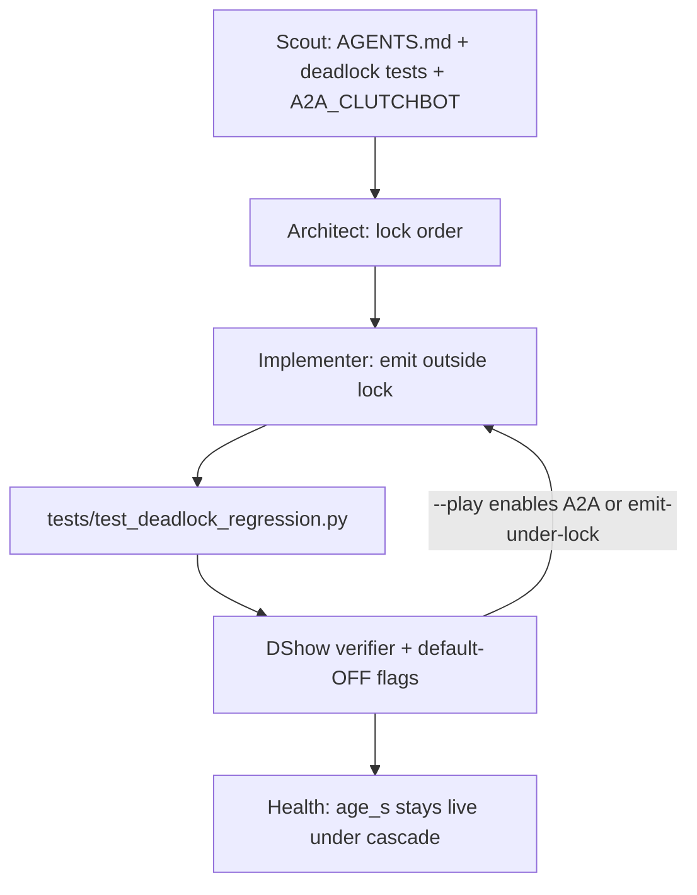

# QORGRAPH — A2A re-entrancy; keep A2A default OFF

**Compose:** after [`QORGRAPH_DSHOW_VERIFIER.md`](./QORGRAPH_DSHOW_VERIFIER.md).  
Verifier = DShow node + default-OFF flags.

**Loop:** `a2a-reentrancy-default-off`  
**Plane:** `spectator` (optional chat under policy — not clutch truth)

## Intent

Harden the 2026-08 deadlock class. A2A and Agent Society stay **default OFF**. `--play` must not enable them. Enabling A2A “for better presence” is a refused Truth-adjacent edge: A2A is sparse scene↔chat under local policy, not a presence/truth plane, and it does not replace OCR / scoreboard VLM referee. Propose opt-in `--a2a` / env only. `qoresence.bat` may pass `--a2a` as a *launcher* default; that is not a Python `--play` default. Do not remove `self._tls.in_trigger`. Do not emit bus events while holding a lobe lock.

## Non-goals

- Reviving Agent Society personality roles
- Making Presence Fusion product-path
- OTel exporter taking locks or emitting
- Treating `age_s` climb as a dead card before checking lock order

## Graph



## Loop contract

```yaml
loop:
  name: a2a-reentrancy-default-off
  plane: spectator
  tickets_required: []
  max: 8
  body: |
    plane: spectator / observation
    tickets_required: none from A2A; confirm still owns digits; coupling
      still owns A2A reason=coupling heat
    may_speak: enabled=false by default, in_trigger guard, emit-outside-lock,
      reason codes, veto invented scores, cooldown.
    must_remain_empty: --play implies --a2a, Society personalities,
      emit while holding _lock, presence as truth, dual-open,
      scorelines on path=fast.

    Ground:
    - AGENTS.md Event-Bus Locking Invariants (HARD RULES 1–6)
    - docs/A2A_CLUTCHBOT.md
    - docs/AGENT_SOCIETY.md
    - docs/QORGRAPH_DSHOW_VERIFIER.md
    - tests/test_deadlock_regression.py
    - tests/test_a2a_policy.py
    - tests/test_agent_society.py
    - qoresence/a2a/orchestrator.py
    - qoresence/fusion/presence.py
    - qoresence/cli.py _apply_agent_society / --a2a

    Lock order:
    1. Never emit a bus event while holding your own lobe lock.
    2. maybe_trigger_from_drive stays re-entrancy safe (thread-local
       self._tls.in_trigger). Do not remove it.
    3. PresenceFusionEngine computes under lock; _emit_report runs after.
    4. Never hold a non-reentrant lock across a subscriber callback.
    5. OTel _on_event enqueue-only.
    6. OTel re-entrancy tracker is observation-only smoke, not control.

    Default-OFF:
    - python -m qoresence.cli --play  MUST NOT start A2A or Society
    - --a2a / QORESENCE_A2A=1 is explicit opt-in
    - --agent-society is leftover stub, no personality ticks
    - Refuse graphs whose purpose is "turn A2A on to prove presence"

    A2A policy if opt-in:
    - Does not replace LocalVLM / scoreboard OCR-VLM / fast path / DriveGraph
    - fast: no explicit scorelines
    - confirm: digits must match local home/away
    - No A2A on pure menu except menu_exit
    - Background thread, never capture loop
  until:
    - pytest tests/test_deadlock_regression.py tests/test_a2a_policy.py tests/test_agent_society.py -q
    - principle_gates:
        - play_does_not_enable_a2a
        - play_does_not_enable_society
        - in_trigger_guard_present
        - emit_outside_lock
        - deadlock_tests_not_deleted
        - one_card_owner
        - otel_enqueue_only
  review:
    - principle_verifier
  persist:
    - PRINCIPLES_AUDIT.md
```

## Frozen refuse line (Truth-adjacent edge)

```
REFUSE: "Enable A2A / Presence Fusion / Agent Society by default so
presence is better."
plane: illegal-cross
replacement:
  Keep --play A2A-off and Society-off.
  If the operator wants scene↔chat, document --a2a as opt-in and
  keep A2APolicy veto on invented scores.
  Presence reports stay research/default-OFF.
  Product path remains actuators: Aperture / Bind / License / Arm.
```

## Tests that must not be deleted or weakened

- `test_reentrant_trigger_from_router_decision_does_not_deadlock`
- `test_suppressed_trigger_emits_outside_lock`
- `test_presence_lock_released_during_report_fanout`
- `test_full_cascade_streamer_event_with_a2a_loop`

## First operator command

```
pytest tests/test_deadlock_regression.py -q
# Then a --play smoke WITHOUT --a2a:
python -m qoresence.cli --play --deck --streamer-device 0 --streamer-fps 30
curl http://127.0.0.1:8765/health
# a2a.enabled should be false; age_s < 1; frames climbing
```

If `age_s` climbs and `frames` stop while the process lives: lock-order deadlock until proven otherwise — not a dead card (`AGENTS.md`).
