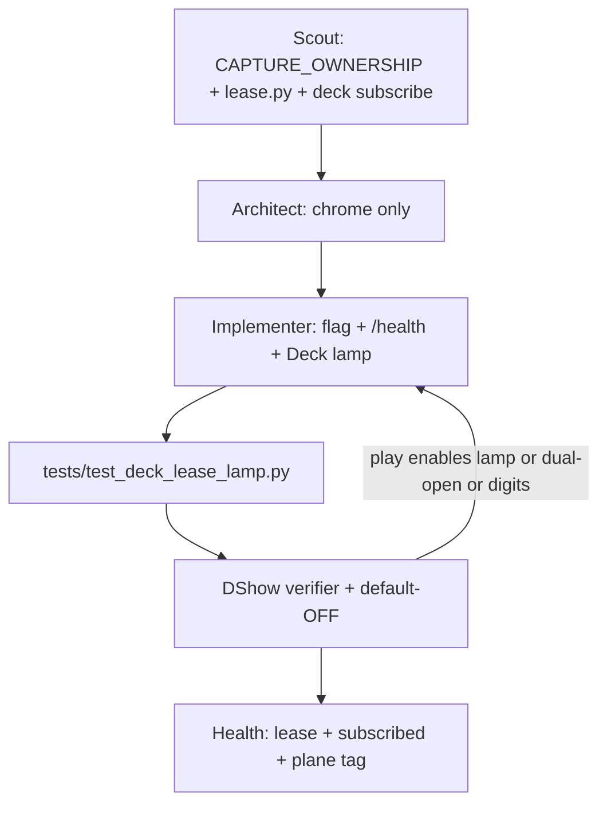

# QORGRAPH — DeckLeaseLamp 0.1 (Local Glass chrome)

**Compose:** after [`QORGRAPH_DSHOW_VERIFIER.md`](./QORGRAPH_DSHOW_VERIFIER.md).  
Verifier = DShow node + this lamp’s default-OFF / subscribe-not-own chrome.

**Loop:** `deck-lease-lamp-0.1`  
**Plane:** `operator-glass` (`qoresence-observation` on every emit)

## Intent

Operator freeze (Qorethink + Qoregraph): prove Sight Glass / Retina Deck is a
**glass on FrameHub**, not a second brain.

DeckLeaseLamp is UI chrome that **leases already-held frames** (subscribe-not-own).
It reads existing `/health.lease` `{ok, owner, pid, device}` plus FrameHub
occupancy (`hub_has_frame` / WebRTC peers). It does not open DShow. It does not
grab. It does not paint score digits.

**Default OFF.** `--play` must not enable the lobe. Dark when `lease.ok` is false
or subscribe is missing. Plane tag on every emit / DOM attribute / API field.

## Non-goals (must remain empty)

- LocalScoreReferee / LocalMuse / FoundryLocalRAG product
- ConfirmTicket claims
- Score digits / last-good numbers / invented 0-0
- A2A / Society default ON
- `wrap_observation` / `*-truth`
- FrameHub ownership steal
- Any new `VideoCapture` / DShow open
- Eval expansion past this lamp

## Graph



## Loop contract

```yaml
loop:
  name: deck-lease-lamp-0.1
  plane: operator-glass
  tickets_required: []
  max: 6
  body: |
    plane: operator-glass
    tickets_required: none
    may_speak: lease.ok, owner, pid, device, subscribed, age_s, frames++,
      lamp on|off|dark, plane tag, flag name.
    must_remain_empty: DShow open, digits, ConfirmTicket,
      LocalScoreReferee/Muse, A2A ON.

    Ground:
    - docs/CAPTURE_OWNERSHIP.md
    - docs/OBS_OWNS_CARD.md
    - docs/QORGRAPH_DSHOW_VERIFIER.md
    - qoresence/capture/lease.py
    - /health.lease shape {ok, owner, pid, device}
    - deck.html subscribe-only path (FrameHub / WebRTC / MJPEG)
    - AGENTS.md capture notes

    Fail the change if ANY of these are true:
    - --play alone enables DeckLeaseLamp
    - Flag/config default is ON
    - Lamp paints ok / 0-0 when lease.ok is false or subscribe is missing
    - Plane tag missing on emit, DOM data-plane, or /health field
    - A new VideoCapture / DShow constructor appears in Deck / lamp / glass paths
    - ConfirmTicket, digits, LocalScoreReferee, LocalMuse, or A2A default ON sneak in

    DualSense on PS5 is observe language only. Empty HID is valid.
    Never invent scores from the pad or the lamp.
  until:
    - pytest tests/test_capture_lease.py -q
    - pytest tests/test_deck_lease_lamp.py -q
    - principle_gates:
        - lamp_default_off
        - play_does_not_enable_lease_lamp
        - plane_tag_on_every_emit
        - dark_when_lease_not_ok
        - no_digit_paint
        - one_card_owner
  review:
    - principle_verifier
  persist:
    - PRINCIPLES_AUDIT.md section DECK_LEASE_LAMP
```

## Frozen fail-closed node (copy-paste)

```
ROLE: Principle Verifier — DeckLeaseLamp 0.1
plane: operator-glass
kind: veto|pass
path: confirm

You do not implement features. You reject PRs that turn Deck into a
second brain or paint a fake lease.

CHECKLIST (every item must be evidenced by file + test, not intent):

[ ] Flag --deck-lease-lamp / QORESENCE_DECK_LEASE_LAMP / config.deck_lease_lamp
    defaults OFF. --play does not latch it.

[ ] Lamp reflects /health.lease + FrameHub subscribe equivalent
    (hub_has_frame or WebRTC peers on source=frame_hub).

[ ] Dark when lease.ok is false or subscribe is missing.
    Never fake ok. Never paint 0-0.

[ ] plane: qoresence-observation on every snapshot, DOM data-plane, API field.

[ ] Diff adds zero VideoCapture / DShow constructors in Deck / lamp / glass paths.

[ ] tests/test_deck_lease_lamp.py still defines:
    - test_deck_lease_lamp_default_off
    - test_play_does_not_enable_lease_lamp
    - test_lamp_emits_plane_tag
    - test_lamp_dark_when_lease_not_ok
    - test_lamp_source_has_no_digit_paint

STOP CHECK:

    pytest tests/test_capture_lease.py -q
    pytest tests/test_deck_lease_lamp.py -q

PASS only if the lamp is chrome on a held lease. Veto language:
"DUAL_OPEN — card already has an owner. Subscribe."
Do not suggest opening the card again for Theater.
```

## First operator command

```
python -m qoresence.cli --play --deck --streamer-device 0
curl http://127.0.0.1:8765/health
# deck_lease_lamp omitted (OFF)

python -m qoresence.cli --play --deck --deck-lease-lamp --streamer-device 0
curl http://127.0.0.1:8765/health
# deck_lease_lamp.plane = qoresence-observation
# lamp on only when lease.ok and FrameHub subscribe; else dark
```

## Compose note

Attach this node as `review: principle_verifier` after the DShow verifier.
Eval HOLD: chrome only — do not expand past this lamp.
