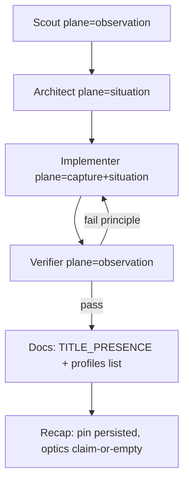

# QORGRAPH — Game profile pin holds

**Compose:** after [`QORGRAPH_DSHOW_VERIFIER.md`](./QORGRAPH_DSHOW_VERIFIER.md).  
Every Implementer / Verifier turn includes the DShow Principle Verifier. Do not dual-open the card.

**Loop:** `game-profile-pin-holds`  
**Plane:** `qoresence-observation`

## Intent

Add or change a profile without yanking an explicit operator pin. Optical title-presence may *observe* a locked title with `plane: qoresence-observation`. It must not overwrite `--game-profile` / `QORESENCE_GAME_PROFILE` / `~/.qoresence/last_game_profile`. First-run with no pin falls back to `ncaa_football_27` (unpinned, optics may still lock). Community YAML lives in `profiles/*.y*ml` (`docs/COMMUNITY_PROFILES.md`).

## Non-goals

- New truth-plane wrap dests
- Auto-swap of a pinned Madden session to CFB because optics liked a menu
- Digits on `path=fast`
- New MCP wrap tools

## Graph



## Loop contract

```yaml
loop:
  name: game-profile-pin-holds
  plane: qoresence-observation
  tickets_required: []
  max: 8
  body: |
    You are the Implementer node for Qoresence game profiles.
    plane: qoresence-observation
    tickets_required: none
    may_speak: profile_id, display_name, category, event_types, optical
      lock state (unknown|transitioning|overlay-rejected|locked),
      claim=true only when locked, plane tag, no_claim_reason.
    must_remain_empty: score digits, names-as-eligibility, wrap dests
      containing qortroller / poac / *-truth.

    Ground first:
    - docs/TITLE_PRESENCE.md
    - docs/COMMUNITY_PROFILES.md
    - docs/QORGRAPH_DSHOW_VERIFIER.md
    - tests/test_title_presence.py
    - tests/test_operator_profile.py
    - tests/test_cfb_27_profile.py
    - tests/test_madden_profile.py
    - tests/test_profile_sdk.py
    - qoresence/cli.py resolve_operator_profile / game_profile_pinned

    Invariants:
    1. Explicit --game-profile is pinned. Locked optical title is observed
       and logged; it does not yank the operator profile.
    2. Pin persists to ~/.qoresence/last_game_profile. Env
       QORESENCE_GAME_PROFILE also pins.
    3. game_detected only when locked (claim=true). Payload includes
       plane: "qoresence-observation" and nested title_presence.
    4. claim==false → profile_id is null; prefer no claim over unstable title.
    5. Frames from FrameHub get_latest first, then streamer buffer.
       Never a second capture card.
    6. Menu / pause / overlay-rejected sleep the scorebug
       (DARK_THEATER_SAME_SEQ). LIVE goes dark when title-presence is not play.
    7. Community profiles are YAML in profiles/. No Python required for
       a new id. Built-ins stay: ncaa_football_27, madden_27, call_of_duty,
       valorant, apex_legends, fortnite.
    8. wrap_observation_for_plane allowlist is qoresence-research only.
       Grant required. Optical record is never mutated.
  until:
    - pytest tests/test_title_presence.py tests/test_operator_profile.py tests/test_profile_sdk.py tests/test_cfb_27_profile.py tests/test_madden_profile.py -q
    - principle_gates:
        - explicit_pin_not_yanked
        - plane_tag_qoresence_observation
        - claim_false_profile_id_null
        - no_second_capture
        - wrap_deny_list
        - lobes_default_off
        - one_card_owner
  review:
    - principle_verifier  # docs/QORGRAPH_DSHOW_VERIFIER.md plus pin checklist
  persist:
    - PRINCIPLES_AUDIT.md
    - profiles/<id>.yaml if community
```

## Frozen Architect prompt

```
plane: qoresence-observation
tickets_required: none
Write PROFILE_PLAN.md with:
- profile_id / aliases / category / event_types / outcome_fields
- pin path: CLI flag → env → last_game_profile → unpinned ncaa_football_27 fallback
- title_presence FSM states and which ones emit game_detected
- Theater Plane Dim behavior on overlay-rejected / menu / pause
- What stays empty when claim==false
Refuse any design where optics overwrite a pinned --game-profile.
```

## First operator command

```
python -m qoresence.cli --profiles-list
python -m qoresence.cli --play --deck --streamer-device 0 --game-profile madden_27
# lock must keep madden_27 even if optics see another title
curl http://127.0.0.1:8765/health
```

Empty success: `title_presence` state changes exist; `game_detected.plane == qoresence-observation`; pinned profile unchanged; digits stay □–□ until confirm ticket + `score_vlm_locked`.
