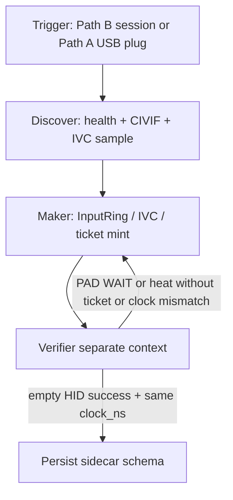

# QORGRAPH — IVC empty HID is success (Path B)

**Compose:** after [`QORGRAPH_DSHOW_VERIFIER.md`](./QORGRAPH_DSHOW_VERIFIER.md).  
Review includes the DShow verifier. Do not dual-open the card.

**Loop:** `ivc-empty-hid-success`  
**Plane:** `qoresence-observation`

## Intent

Path B is the live default: DualSense stays on the PS5. Laptop HID empty is honest success (`/health state.controller.waiting`, `connected=false`, CIVIF `controller_bodied=false` reason `pad_not_on_this_host`). Not PAD WAIT. Not an error. USB/BT on this host is Path A lab probe. Same `clock_ns` on press + frame. Heat speech requires a live coupling ticket (`pll_lock` + fresh video + phrase in SNAP/SPRINT/CUT/RELEASE). THROW is forbidden.

## Non-goals

- Requiring PC-visible pad for SYNC
- Coaching off Deck
- Authorship / anti-cheat language
- Ghost Stick last-good pose on menu
- Haptic probe setting `controller_bodied`

## Graph



## Loop contract

```yaml
loop:
  name: ivc-empty-hid-success
  plane: qoresence-observation
  tickets_required: [coupling]
  max: 10
  body: |
    plane: qoresence-observation
    tickets_required: coupling for heat / pad-picture; none for empty-HID honesty
    may_speak: coupling, co-occurrence, precursor_ms, lag_center_ms,
      pll_lock, phrase IDLE|HUDDLE|SNAP|SPRINT|CUT|RELEASE,
      controller_bodied, pad_not_on_this_host, clock_ns, frame_seq.
    must_remain_empty: PAD WAIT as failure, invented 0-0, THROW,
      heat without ticket, digits without confirm ticket,
      button names unless pad bodied on this host.

    Ground first:
    - docs/CONTROLLER_VIDEO_SYNC.md
    - docs/PLAY_PHRASE_COUPLING_TICKET.md
    - docs/CIVIF.md
    - docs/GHOST_STICK.md
    - docs/QORGRAPH_DSHOW_VERIFIER.md
    - tests/test_ivc.py
    - tests/test_coupling_ticket.py
    - tests/test_controller_lobe.py
    - tests/test_civif_coupling.py
    - qoresence/sync/*

    Path B (default live):
    - DualSense on PS5. Laptop HID empty = success.
    - Play clock is the TV. Observatory admits picture lag.
    - Never coach play-off-Deck.

    Path A (lab): USB/BT after Deck is up; HID re-open every 1.5 s.
    Fixture: qoresence.sync.dualsense_fixture.feed_bodied_r2

    Clock:
    - IVC joins [t_video − lag_hi, t_video − lag_lo + lead]
    - Default lag_lo=0, lag_hi=120, lead=24
    - Every HID edge and joined sample carries clock_ns / frame_seq
    - Press and frame share the same nanoseconds at bind
    - Stale FrameHub age_s > 200 ms decays coupling
    - Frozen video does not walk the PLL

    Ticket:
    - Domain QORESENCE-COUPLING-TICKET-v0
    - Mint only pll_lock + video_fresh + phrase in {SNAP,SPRINT,CUT,RELEASE}
    - No mint on IDLE/HUDDLE or pll_lock=false
    - Expire IDLE/HUDDLE or ~400 ms
    - license_heat_text(heat, ticket=None) == ""
  until:
    - pytest tests/test_ivc.py tests/test_coupling_ticket.py tests/test_controller_lobe.py tests/test_civif_coupling.py -q
    - principle_gates:
        - empty_hid_is_success
        - no_pad_wait_failure
        - same_clock_ns_press_and_frame
        - no_heat_without_coupling_ticket
        - no_throw_phrase
        - haptic_does_not_body_controller
        - one_card_owner
  review:
    - principle_verifier  # docs/QORGRAPH_DSHOW_VERIFIER.md
  persist:
    - PRINCIPLES_AUDIT.md
    - clip sidecar contract reminder: .coupling.json keyed by frame_seq + video_clock_ns
```

## Frozen Verifier questions

1. Does `/health` treat `connected=false` + `pad_not_on_this_host` as success on Path B?
2. Does any UI string say PAD WAIT as failure?
3. Can `mint_coupling_ticket(..., pll_lock=False)` return a ticket? Must be no.
4. Do press events and joined frames share `clock_ns` / `frame_seq`?
5. Does heat speech survive `license_heat_text(..., ticket=None)`? Must be empty.

## First operator command

```
curl http://127.0.0.1:8765/health
# Path B: controller.connected=false is OK
# coupling.imu_bodied only after a DualSense press with IMU jolt on THIS host
```
