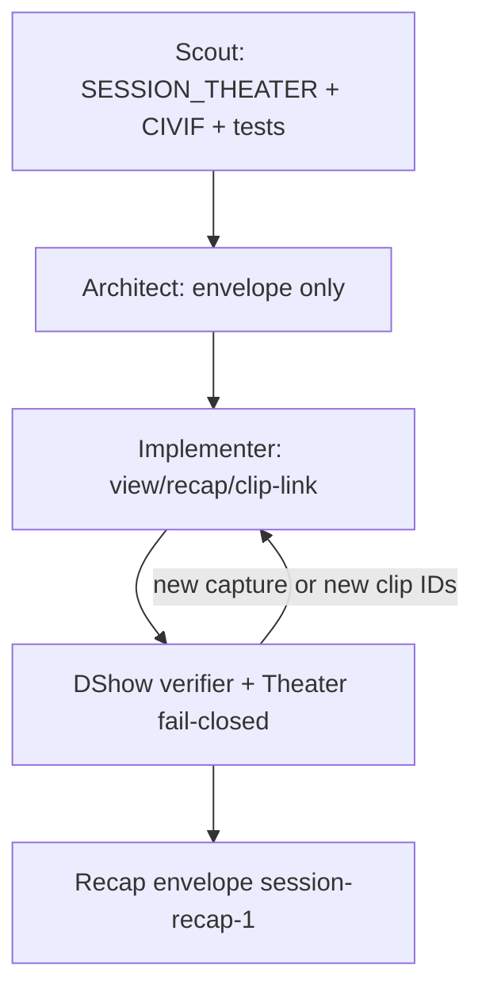

# QORGRAPH — Session Theater is a query (no second capture)

**Compose:** after [`QORGRAPH_DSHOW_VERIFIER.md`](./QORGRAPH_DSHOW_VERIFIER.md).  
Verifier = DShow node + Theater fail-closed exclusions.

**Loop:** `theater-query-not-capture`  
**Plane:** `operator-glass`

## Intent

Recap is a **query** over the fail-closed normalized pack. Canonical path already shipped:

`CIVIF → NarrativeEngine → normalize_pack → live Session Theater → validated clip links → read-only recap`

Not HDMI Theater (`/deck.html`). Not `/civif.html`. Not a second capture. Open clip only for existing `hdmi_clip_*` MP4s whose `.coupling.json` `session_id` matches. Missing / unlicensed fields → empty glyphs, not invented last-good digits. Digits on Now require `score_vlm_locked` **and** a non-empty ConfirmTicket. Flag-only lock stays dark. `board_why` is the honest sentence.

## Non-goals (still excluded on main docs)

- streamer overlay
- clip-dock on `/session.html`
- new clip ID format
- `/civif.html` rewrite
- MCP `civif_narrative` / `civif_session_view` / `export_clip`
- mixing issue #65 full-matrix `pytest tests/ -x` into this worktree

## Graph



## Loop contract

```yaml
loop:
  name: theater-query-not-capture
  plane: operator-glass
  tickets_required: [confirm]  # digits only
  max: 8
  body: |
    plane: operator-glass
    tickets_required: confirm + score_vlm_locked for digits; none for empty pack
    may_speak: session-view-1, session-recap-1, board_why, status
      live|empty|not_persisted|unavailable|invalid, clip.available,
      incomplete, empty_reason, freshness.stale.
    must_remain_empty: second HDMI grab, new clip IDs, raw evidence.clip_ids,
      operator "confirm: none" on the Now HUD, last-good overlay digits,
      button names unless pad bodied on this host, MCP civif_* tools.

    Ground:
    - docs/SESSION_THEATER.md
    - docs/CIVIF.md
    - docs/DARK_THEATER_SAME_SEQ.md
    - docs/QORGRAPH_DSHOW_VERIFIER.md
    - tests/test_session_theater.py
    - tests/test_session_clip_link.py
    - tests/test_session_recap.py
    - tests/test_board_why.py

    Surfaces:
    - /session.html Now + Story + Recap
    - GET /api/session/view
    - GET /api/session/recap
    - Open clip only when clip.available and stem matches hdmi_clip_<token>
    - Client: one tickAll timer; no /session_fixtures/*.json fetch

    Foundry pack Recap may read (existing files only):
    - clips/<stem>.mp4
    - .chapters.json .buttons.json .coupling.json
    - .otel.json only if --otel was on at export (default OFF)

    Clip membership: coupling.json session_id must equal view session
    (non-empty string). Paths, %, NUL, aliases, missing files,
    cross-session → {available: false}.
  until:
    - pytest tests/test_session_theater.py tests/test_session_clip_link.py tests/test_session_recap.py tests/test_board_why.py -q
    - principle_gates:
        - no_second_capture
        - no_new_clip_ids
        - digits_need_confirm_and_vlm_lock
        - missing_fields_empty_glyphs
        - open_clip_existing_mp4_only
        - one_card_owner
  review:
    - principle_verifier  # QORGRAPH_DSHOW_VERIFIER + Theater exclusions list
  persist:
    - PRINCIPLES_AUDIT.md
```

## Frozen Architect constraint

```
Do not add a capture path to Session Theater.
Recap derives from build_session_response / recap_from_envelope —
no persist, no clip re-resolve.
stale is freshness only; do not invent a status=stale.
Private by default: suppression reasons, session IDs, internal clocks
are not broadcast copy.
Seeing-path gate: do not start one-launcher / auto-clip / friend-recap
until a Madden/CFB hour licenses a score once
(board_why=confirm_ticket) and stays honest when it cannot.
```

## First operator command

```
curl http://127.0.0.1:8765/health
curl http://127.0.0.1:8765/api/session/view
curl http://127.0.0.1:8765/api/session/recap
# age_s < 1, frames climbing; blank Now shows board_why, not fake 0-0
```
